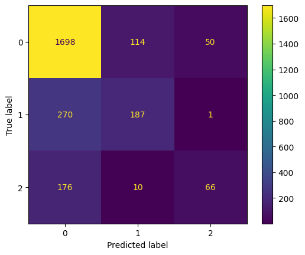
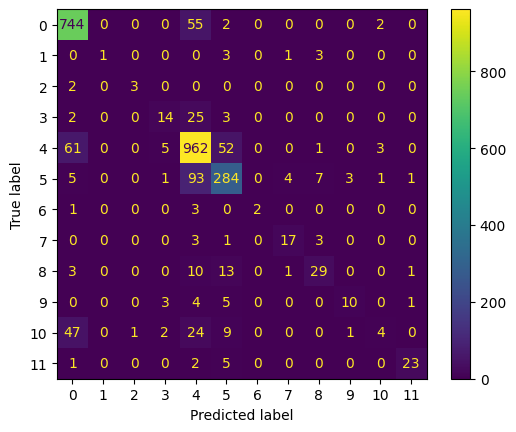

# Automatic Customer Ticket Classification

This repository belongs to Team 3 for KAIST CS372 Natural Language Processing with Python course.

## Introduction

This project introduces an automated ticket classification system using Natural Language Processing (NLP) with Python's NLTK library. The goal is to streamline customer service by automatically categorizing support tickets into specific classes such as 'Issue', 'Refund', and 'Feedback'. This approach aims to improve response times and overall efficiency by identifying the main topic, recognizing the product referenced, suggesting a response type, and generating a concise summary of the complaint. The system's automation could potentially lead to quicker issue resolution, reducing the need for extensive human intervention and enhancing overall customer satisfaction.

## Dataset
The dataset for this project, sourced from Kaggle's "[Automatic Ticket Classification](https://www.kaggle.com/datasets/venkatasubramanian/automatic-ticket-classification)" by Venkatasubramanian Sundaramahadevan, comprises 78,313 customer complaints from a financial company, featuring 22 attributes. The relevant columns extracted for analysis are: `complaint`, `company_response`, and `product`. This dataset has found applications in NLP and Text Mining research and is a valuable resource for our project.

## Result

    

        
        
(a) Caption for Response Image

    

    

        
        
(b) Caption for Product Image

    

Our project has significantly improved customer service operations, reducing reading time by 40%. This efficiency boost allows agents to handle a larger ticket volume. The system's topic modeling, though moderately coherent (0.599), presents room for improvement. Notably, product tagging achieved an accuracy of 0.825, and response tagging reached 0.753, showcasing high precision and minimal misclassification. Further iterations aim to enhance topic coherence for better complaint categorization.

#### For more details of this project, please refer to our [presentation slides](https://docs.google.com/presentation/d/1oQFnkYC6nGRGeBq2qXt4d3YsHFwTTmtc97VSOb1rXdo/edit?usp=sharing).
